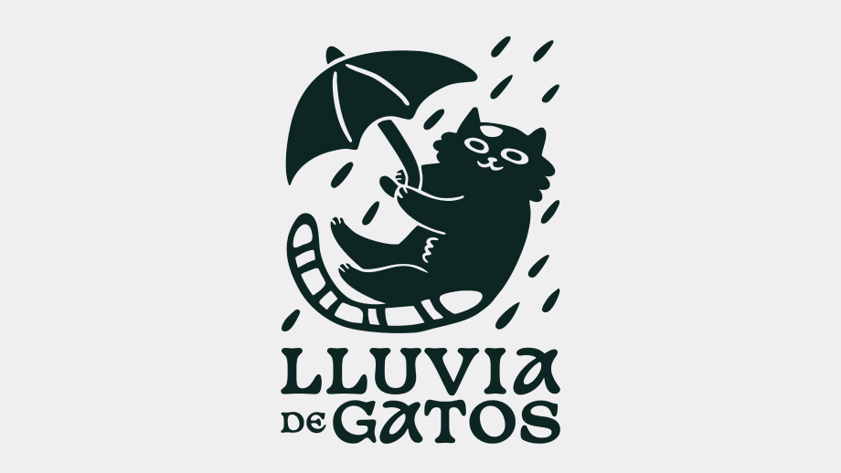
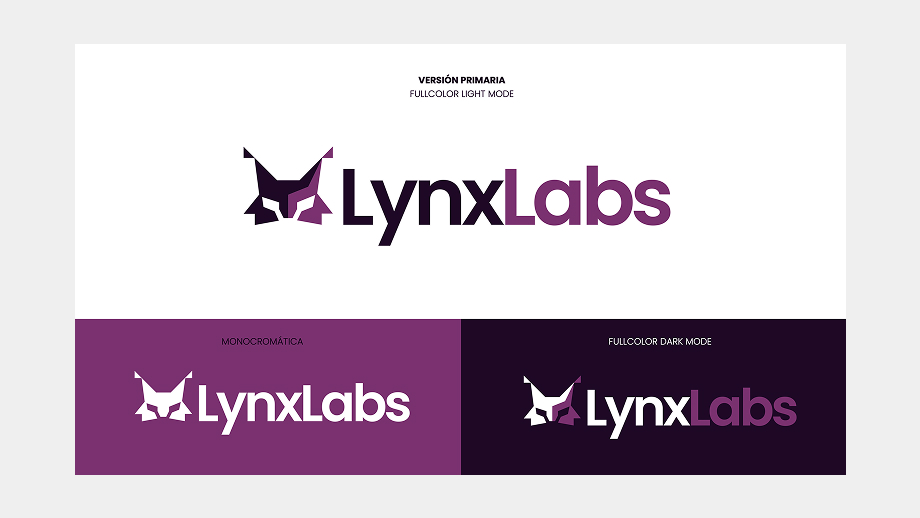
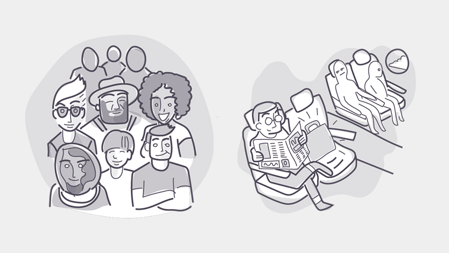
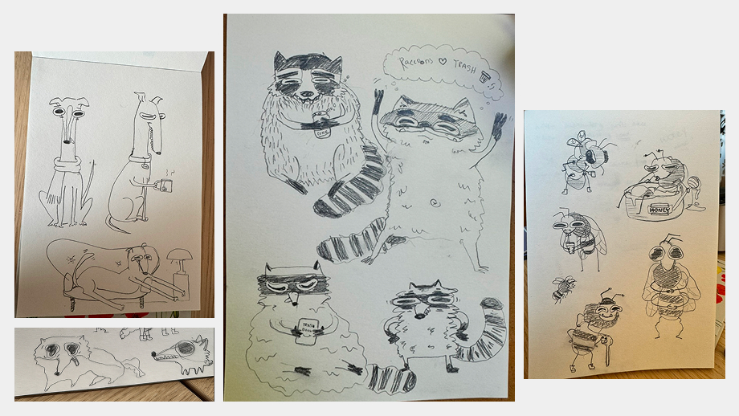
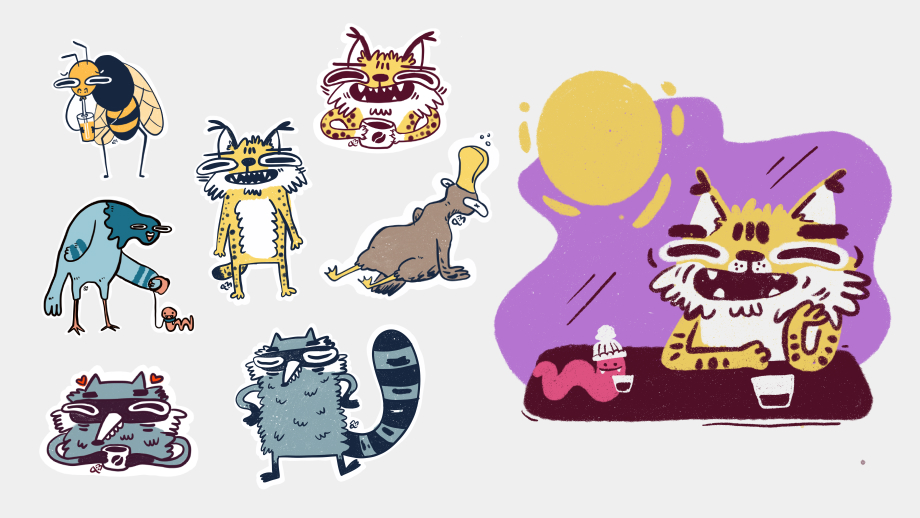
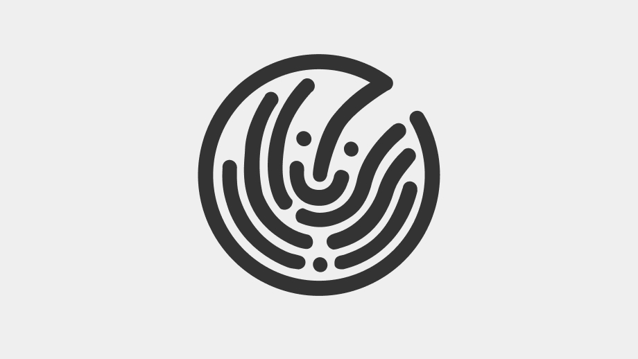

### Branding 

##### Lluvia de Gatos

*Lluvia de gatos is a Brand for a bookbinding artist*

#### Lynx Labs

*Lynx Labs Branding*

### Illustration
During my free time and as part of working my creative side I try to draw and illustrate whenever I can. Sometimes it is not as often as I would like but here is a selection of fun personal projects I have worked on so far. 

#### Workshop Illustrations
During my work at Acklen Avenue, I collaborated on a few internal assets, These were a collection of illustrations used for a workshop on a Camp session. We discussed the topic and the slides with my Engagement Manager, and this was the result: 

*Illustrations to explain different aspects of culture and communication*

*Some of the collaborators, including me*

#### Animalitos feos
This is my most recent sketching project. It started randomly when Youtube recommended me [this video](https://youtu.be/kngc8LXYdkc?si=KP9Q9htg8VRQfEuS), and it was instantly revealing and refreshing. Maybe it was the voice of the artist, the silly drawings; something on it made me feel inspired to draw animals.

It started as an individual creative explorative exercise. But quickly, after a couple of days it became a more defined goal: to draw “Animalitos feos” for an entire month (on a Mon-Fri basis). 
I invited a friend to join me in this silly challenge and she accepted. We had so much fun.

*Silly drawings*

We picked an animal per day. I didn’t want to put too much pressure on myself and enjoy the process, so I drew mostly with graphite o a sketchbook. The main idea was to draw the most silly, quirky and ugly-ish animals. 

Here are the favorites, turned into stickers afterwards:  

*Stickers and riso print*

#### Bonus: Fingerprint Icon Lau 
For Laureate International Universities I designed this fingerprint icon. It was used on a Portal for Students, where user were able to manage all of their personal and identification information, something like a digital student passport. 

