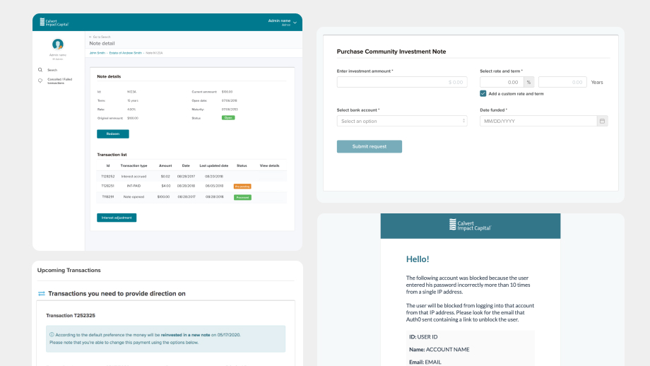

### Overview

Calvert Impact Capital is a non-profit in the Financial Industry. I collaborated with a complete team as a UX/UI designer, when I worked at a Software Development Company. We were doing Enterprise UX for their organization Platform.

*Calvert Impact Capital admin UI*

### My Role
The goal was to deliver a user friendly platform that allowed different user roles (Advisors, Investors and Admins) to manage information and transactions. We launched the project after a few months of development, and we maintain the engagement for iterations a couple of months after. My role was as a support designer at the beginning, and then I transitioned to lead designer of the team. 

### How we worked
We worked under the Agile methodology: 

#### Discovery
There was a discovery session at the beginning of the engagement, and a few follow-up discovery sessions after the first launch. It took place in the first two weeks of the Engagement. 

#### Definition 
The definition was the extraction of the business and user requirements and Epics to have as a base for the creation of users stories to develop

#### Continuous Delivery
A loop of Planning, Designing and Developing, and finally Testing. And repeating this process on a Weekly Sprint basis so that we could complete the Epics. The continuous delivery goal is to give value continuously and maximize the customer satisfaction, reduce risk, and improve product quality.

#### Handoff
The official transfer of all the work, documentation and any other asset created during the project. 

*Agile Team process*

### Lessons Learned 
- Enterprise UX has different challenges, more specific and niche problems to solve, compared to designing an interface that will be used by regular customers. People are used to doing their work in a certain way, they don’t want to be “engaged” with the product, but rather do things correctly and efficiently. 
- Working closely with the development team, and finding new ways to collaborate in the frontend so that the experience can be implemented as expected, considering the constraints of the libraries.
- My biggest learning from working in this project is that client stakeholders are other people doing their jobs, not exactly someone that needs to be “entertained” by flashy demos. A demo can be just a quick board view and get the answers and information needed for the next Sprint. 

