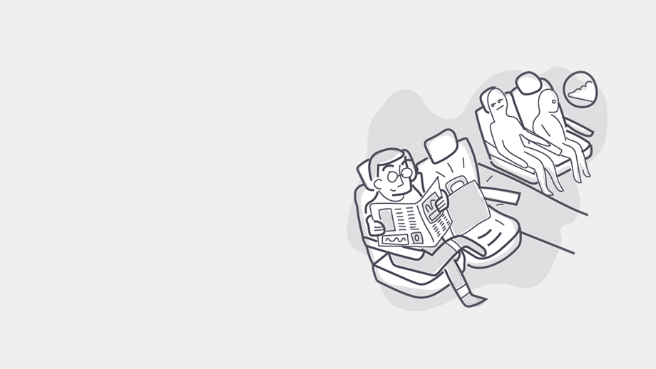
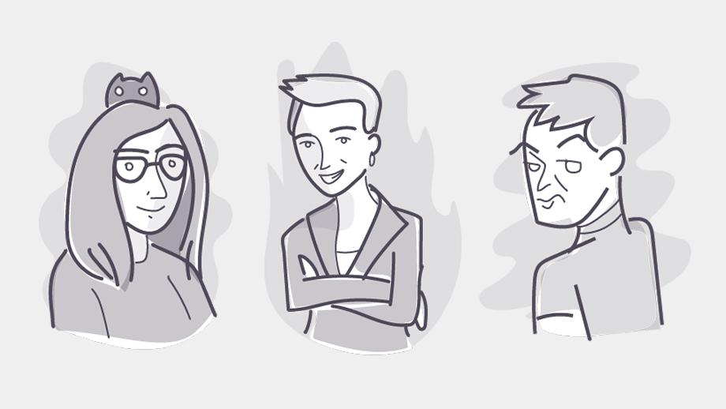

### Illustration
During my free time and as part of working my creative side I try to draw and illustrate whenever I can. Sometimes it is not as often as I would like but here is a selection of fun personal projects I have worked on so far. 

#### Workshop Illustrations
During my work at Acklen Avenue, I collaborated on a few internal assets, These were a collection of illustrations used for a workshop on a Camp session. We discussed the topic and the slides with my Engagement Manager, and this was the result: 

*Illustrations to explain different aspects of culture and communication*

*Some of the collaborators, including me*

#### Prizes for Christmas contest 
During my work at Laureate we had a pretty good culture in the Technology Team. We came up with this tradition for Christmas where we gathered votes with a poll for different funny categories. I hope none of the Categories feel awkward haha, I apologize in advance for that. 

IMG - Illustrations (2col grid) 

#### Animalitos feos
This is my beloved most recent sketching project. It started during a rough season, I was struggling with my mental health, feeling stuck, with impostor syndrome and just burned out. 
Some day Youtube recommended [this video](https://youtu.be/kngc8LXYdkc?si=KP9Q9htg8VRQfEuS), and it was kind of revealing and refreshing. 

Maybe it was the voice of the artist, the silly drawings, but something on it made me feel better instantly. And it also inspired me into drawing again. 

It started as an individual drawing exercise. But super quick, after a couple of days it became a more defined goal, and it was to draw “Animalitos feos” for an entire month (on a Mon-Fri basis). 
I invited a friend of mine to join me in this silly-weird challenge and she accepted. 

IMG - Illustrations (2col grid + info)
We picked an animal per day. And I didn’t want to put too much pressure on myself and I drew mostly with graphite and without adding many colors. Trying to draw the most silly and ugly animals that I could. It was so much fun. I felt sorry for some of them. 

We had so much fun, here are the best results turned into stickers afterward:  

IMG - All Stickers Illustrations (2col grid) 

#### Bonus: Fingerprint Icon Lau 
Last but not least, again for Laureate International Universities, I created this little fella. It was actually an Icon for a User Portal for Students. Where they were able to manage all of their personal and identification information. 

### Branding Collaborations 

##### Lluvia de Gatos
IMG - LOgo + Sello 

#### Lynx Labs
IMG - Logo + Enlace sitio 
