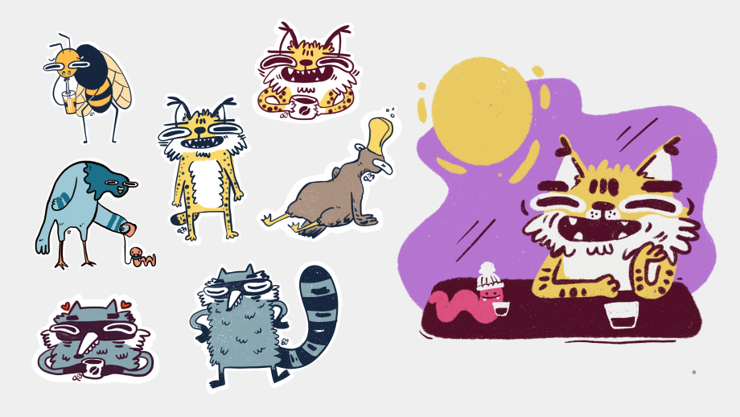
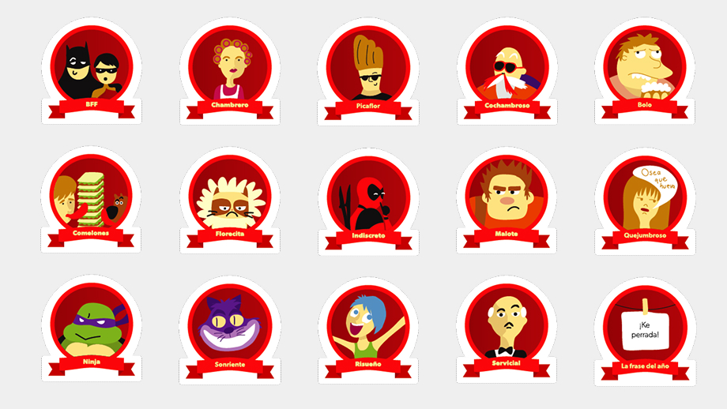
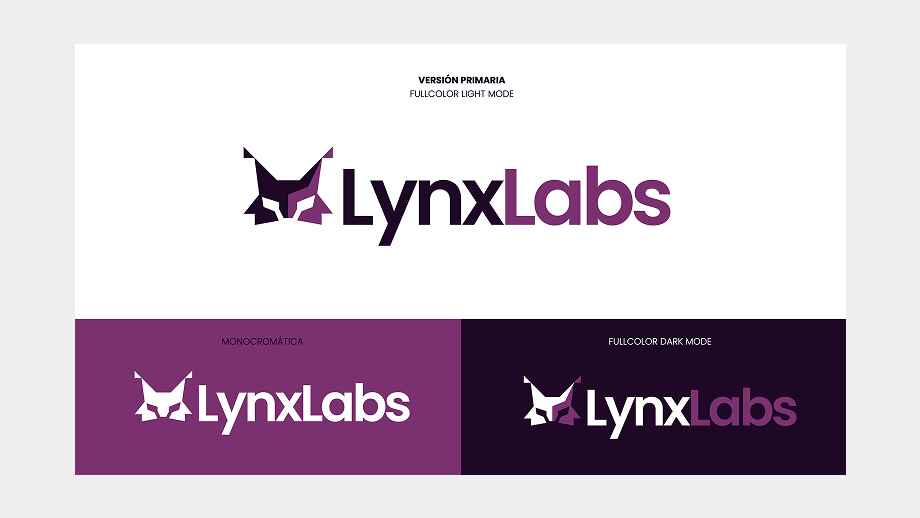

### Illustration
During my free time and as part of working my creative side I try to draw and illustrate whenever I can. Sometimes it is not as often as I would like but here is a selection of fun personal projects I have worked on so far. 

#### Workshop Illustrations
During my work at Acklen Avenue, I collaborated on a few internal assets, These were a collection of illustrations used for a workshop on a Camp session. We discussed the topic and the slides with my Engagement Manager, and this was the result: 

*Illustrations to explain different aspects of culture and communication*

*Some of the collaborators, including me*

#### Animalitos feos
This is my beloved most recent sketching project. It started during a rough season, I was struggling with my mental health, feeling stuck, with impostor syndrome and just burned out. 
Some day Youtube recommended [this video](https://youtu.be/kngc8LXYdkc?si=KP9Q9htg8VRQfEuS), and it was kind of revealing and refreshing. 

Maybe it was the voice of the artist, the silly drawings, but something on it made me feel better instantly. And it also inspired me into drawing again. 

It started as an individual drawing exercise. But super quick, after a couple of days it became a more defined goal, and it was to draw “Animalitos feos” for an entire month (on a Mon-Fri basis). 
I invited a friend of mine to join me in this silly-weird challenge and she accepted. 

*Initital silly drawings*

We picked an animal per day. And I didn’t want to put too much pressure on myself and I drew mostly with graphite and without adding many colors. Trying to draw the most silly and ugly animals that I could. It was so much fun. I felt sorry for some of them. 

We had so much fun, here are the best results turned into stickers afterward:  

*Stickers and riso print*

#### Bonus: Fingerprint Icon Lau 
For Laureate International Universities I designed this fingerprint icon. It was used on a Portal for Students, where user were able to manage all of their personal and identification information, something like a digital student passport. 

#### Prizes for Christmas contest 
During my work at Laureate we came up with a tradition for Christmas, a contest for funny categories. Thw prizes were keychains with the category character, as a trophy. 

*No comments*

### Branding 

##### Lluvia de Gatos

*Lluvia de gatos is a Brand for a bookbinding artist*

#### Lynx Labs

*Lynx Labs Branding*
