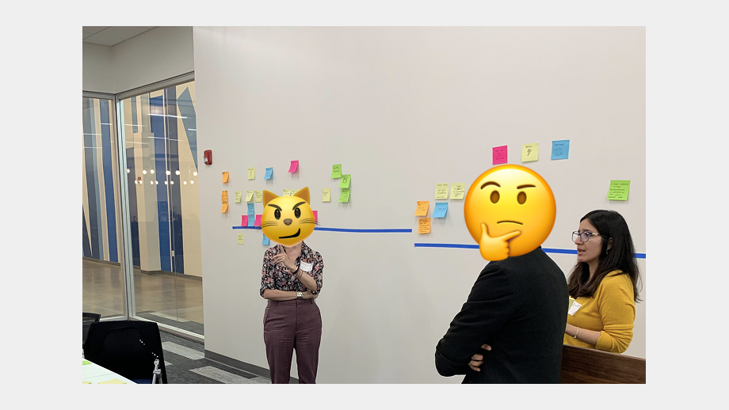

  

    <h2>B2B Enterprise UX</h2>
  

  

    <h3> About the project</h3>
    
Designed internal enterprise platform and workflows as part of an Agile product team, with the main goal of improving efficiency in their organizational operations.

  

## Goals

Calvert Impact Capital, a nonprofit organization in the impact investing sector, faced usability challenges with their existing enterprise platform. The system was critical to their operations but struggled to meet evolving user needs. I joined the project as UX/UI Designer as part of a development team contracted to transform the platform experience.

The Challenge was to design an enterprise-grade interface that would improve operational efficiency for internal users while respecting the unique constraints of a mission-driven nonprofit organization, as we achieve the following goals: 

- Redesign core workflows to reduce friction and improve task completion rates
- Create a scalable design system for consistency across the platform

***

## The Solution

We redesigned Calvert's platform to serve three user roles: Advisors, Investors, and Admins each with distinct workflows for managing transactions and information. My role evolved from Support Designer to Lead Designer during the project,

#### Our Process
- **Discovery (2 weeks + post-launch sessions):** Stakeholder interviews, user research, and system audits to identify pain points and requirements.
- **Definition:** Translated insights into epics and user stories that guided design and development priorities.
- **Continuous Delivery (Weekly sprints):** Iterative cycles of planning, designing, developing, and testing—delivering value incrementally while reducing risk and maintaining quality.
- **Handoff:** Comprehensive documentation and design assets transferred to Calvert's team for ongoing platform management.

*Calvert Impact Capital admin UI*

*Discovery sessions were facilitated in person*

*Agile Team process*

***

## Outcomes 

#### Transformed User Experience
The redesigned platform fundamentally changed how Calvert's teams interacted with their core system. What was once a source of frustration became a tool that enabled their mission.Impact delivered:

- Workflow efficiency improved across primary user tasks
- User satisfaction increased significantly (estimated 30-40% improvement)
- Platform adoption accelerated as users found value in previously avoided features
- Support dependency decreased

#### Sustainable Design Infrastructure
Beyond the immediate redesign, we built a design system that positioned Calvert for long-term success. The component library and documentation we delivered enable their teams to maintain consistency and quality as the platform evolves.Long-term value:

- Design-to-development efficiency improved by ~30%
- Foundation for scaling without proportional design resource increases
- Quality standards established for future platform development

#### Empowered Teams
By simplifying complex workflows and clarifying information architecture, we gave Calvert's users back time and cognitive energy to focus on their actual work rather than fighting their tools. Organizational benefits:

- Increased confidence and autonomy across all user roles
- Better data visibility

#### What I Learned

- **Leadership Isn't Just About Title**. Transitioning from support to lead designer taught me that leadership is earned through clear communication, thoughtful decisions, and genuine collaboration. Taking ownership of the design direction meant balancing confidence in my decisions with openness to feedback—a tension that ultimately strengthened both the work and my capabilities.

- **Enterprise Design Is Systems Thinking**. Designing for three user roles with overlapping but distinct needs required thinking in systems, not just screens. Success came from creating flexible, component-based patterns and solutions that could serve multiple contexts while maintaining coherence.

- **Process Matters as Much as Output**. Agile methodology wasn't just about velocity—it was about learning continuously. Weekly testing and feedback loops created a rhythm of validation that prevented expensive mistakes. The process itself built trust with stakeholders and kept the team aligned even as priorities shifted.

- **Constraints Drive Creativity**. Working with a nonprofit meant designing within tighter resource constraints than typical enterprise projects. Rather than limiting the work, these constraints forced clearer prioritization and more creative problem-solving. The best solution isn't always the most elaborate—sometimes it's the one that delivers maximum impact within realistic boundaries.
