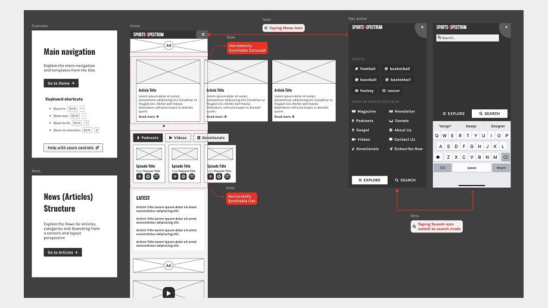
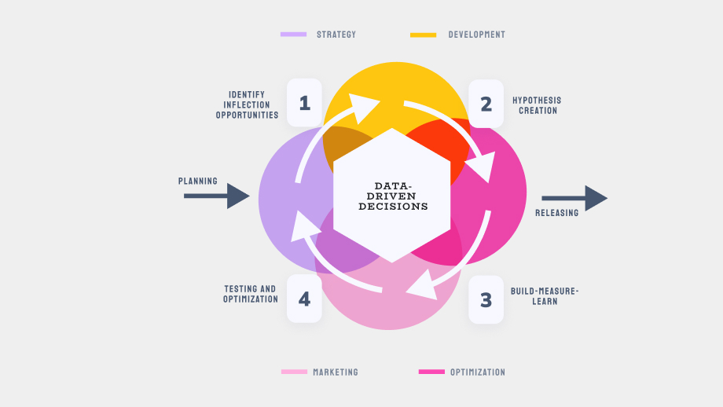

### Overview and Issue

Call me “old school”  but I have always found CMS s a go-to for empowering small businesses with their products. 

Last year I collaborated with two start ups and their websites. Both clients were familiar with CMS tools, and had already implemented their sites, but they were struggling with customization and scalability. 

Me and the development team designed and developed custom themes for both projects. Covering the following requirements: 

### The solution

They needed to adapt to their branding. We integrated the branding, the visuals and the content so that the site looked refreshed and modern. 
All of this, while trying to keep up with the Enterprise UX for the editors feasible, who already had experience updating content and blogs. 
Scalability for new features, plugins, team members working with them. 

*Wireframes for mobile*

*Wireframes for desktop*

### Methodology

We worked implementing the Agile methodology as the following: 

#### Discovery
There was a discovery session at the beginning of the engagement, and a few follow-up discovery sessions after the first launch. It took place in the first two weeks of the Engagement. 

#### Definition 
The definition was the extraction of the business and user requirements and Epics to have as a base for the creation of users stories to develop

#### Build-Measure-Learn
A loop of Planning, Designing and Developing, and finally Testing. And repeating the process on a Weekly Sprint basis so that we could complete the templates. The build-measure-learn goal was to give value continuously and maximize the customer satisfaction, reduce risk, and improve product quality.

#### Launch + Handoff
The official installation of the theme work, documentation and any notes and training delivered.

*Agile-data adapted process*

The result was a new theme launched and installed in the Public sites. We also worked closely with Product, Content and Marketing teams to set up the tool and plugin for A/B testing, SEO, and Analytics for optimization. 

The documentation part was also a big chunk of effort. Documenting the theme structure (owned by the company) and also the wordpress process (tutorials and steps for new editors). 

### Lessons Learned

Through the projects, we encounter challenges and even after some iterations: 

- Working with Start-ups is a unique experience, You have to be open minded for constant changes in OKRs and priorities, as on the overall business level. 
- Collaborating with teams other than technology is always hectic, but also efficient for achieving business goals.
- In Spanish we have a saying *“Más vale malo conocido que bueno por conocer”* in English it would be something like “Better the bad you know than the good you don't”, and I'm talking about Drag and Drop editor Tools. Elementor is the Bad that we know and Thrive editor the Good to know. Selecting plugins and tools for wordpress can be tricky, sometimes more than looking at reviews and how well supported it is, time will give you the answers.
