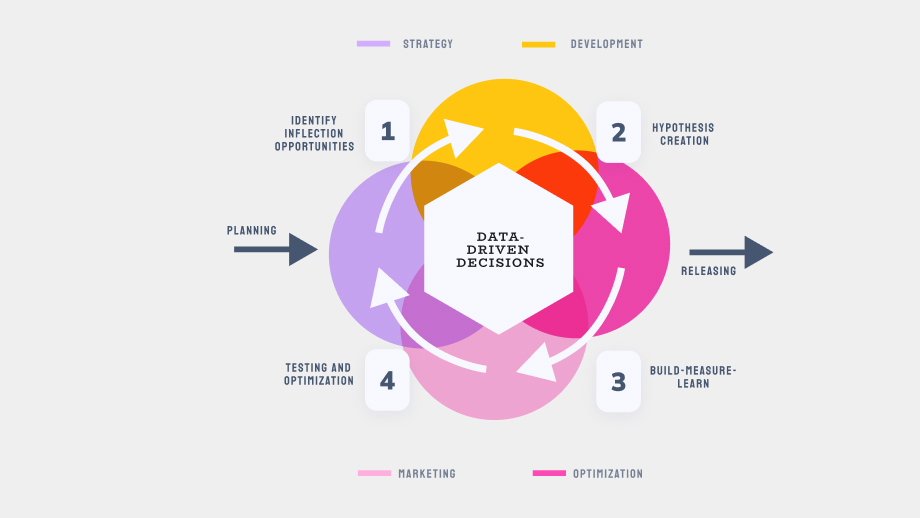
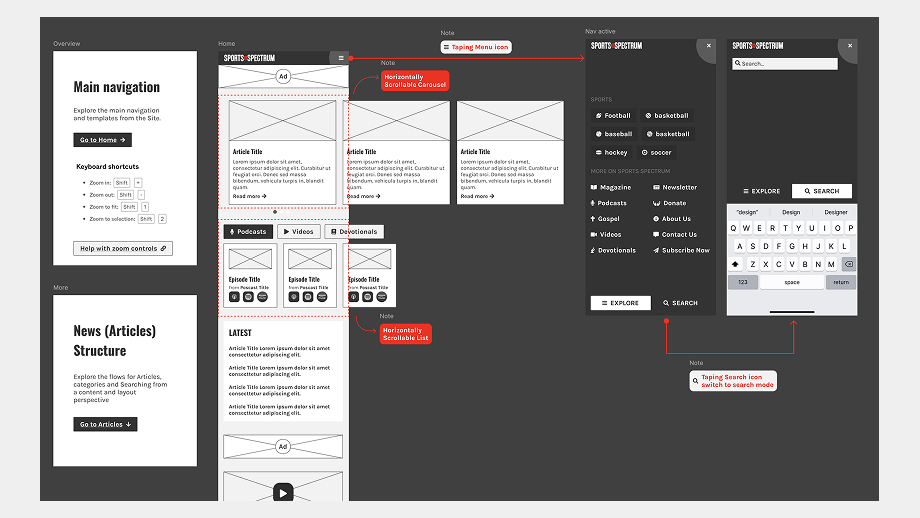
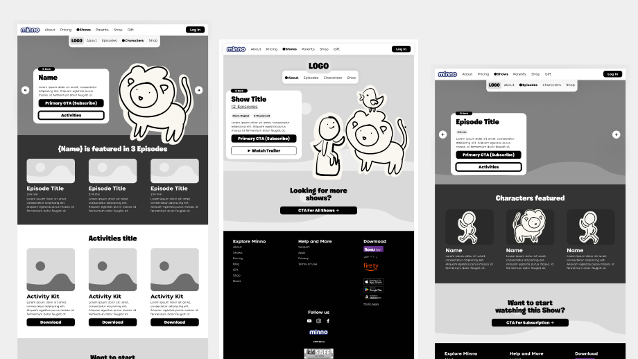

  

    <h2>Startup Website Design and CMS Implementation</h2>
    <a href="https://gominno.com/" class="button"> Live Preview </a>
  

  

    <h3> About the project</h3>
    
The two clients were about building Marketing platforms to empower internal teams to manage content. The goal was to provide a fast, clear, and trustworthy web experience for admins and visitors.

  

## Goals

The two startups that I worked with had a similar challenge: their initial websites were functional but constrained by inflexible CMS platforms.
What needed to change:

- **Customization** – Systems were too rigid to adapt to specific business needs
- **Scalability** – Infrastructure couldn't support growth in content and traffic
- **Usability** – Non-technical teams struggled with content management, creating developer dependencies

**The  main goal:** rebuild their platforms with flexibility, scalability, and user empowerment at the core.

***

## The solution

We designed and developed custom themes for both projects. We implemented custom tools to manage and customize their branding, visuals and the content with arefreshed and modern look. Ensuring a feaseble Enterprise UX for the editors, who already had experience updating content and blogs, but struggled with blockers or limitations with previous themes. Additionally, we make sure to adapt the projects for scalability to implement new features, install and manage plugins, and new allow team members to learn and work efficiently. 

### Methodology

We worked implementing the Agile methodology as the following: 

#### Discovery
There was a discovery session at the beginning of the engagement, and a few follow-up discovery sessions after the first launch. It took place in the first two weeks of the Engagement. 

#### Definition 
The definition was the extraction of the business and user requirements and Epics to have as a base for the creation of users stories to develop

#### Build-Measure-Learn
A loop of Planning, Designing and Developing, and finally Testing. And repeating the process on a Weekly Sprint basis so that we could complete the templates. The build-measure-learn goal was to give value continuously and maximize the customer satisfaction, reduce risk, and improve product quality.

#### Launch + Handoff
The official installation of the theme work, documentation and any notes and training delivered. The result was a new theme launched and installed in the Public sites. We also worked closely with Product, Content and Marketing teams to set up the tool and plugin for A/B testing, SEO, and Analytics for optimization. The documentation was delivered within the handoff, documenting the theme structure (owned by the company) and also the wordpress process including setp-by-step guidelines and instructions for new collaborators. 

*Agile-data adapted process*

*Wireframes for mobile*

*Wireframes for desktop*

***

## Outcomes

The rebuilt CMS platforms transformed from operational constraints into strategic advantages. Both startups now operate with content teams that can publish, update, and experiment independently—without waiting on developer availability.

##### Measurable impact:

- Content publishing workflow accelerated. 
- Marketing team autonomy increased (no technical dependencies for standard operations)

##### Measurable impact:Built to Scale
The new infrastructure provides headroom for growth. Both platforms can handle significant increases in content volume, traffic, and feature complexity.
Technical and non technical outcomes:

- Modular design reduces future development time by 30-40%
- Support marketing opperations providing the ability to manage Landing Pages for Marketing campaigns
- Campaign launch time: from weeks to days
- Real-time content optimization and A/B testing capabilities

#### What I Learned
- Startups don't move in straight lines. Both projects experienced multiple priority shifts, strategy pivots, and OKR changes—sometimes mid-development. This taught me to build for adaptability first: flexible architectures, modular systems, and interfaces that can evolve without requiring rebuilds.
- Working closely with non-technical teams was initially challenging but ultimately critical to success. Understanding marketing workflows, content strategies, and business constraints informed better technical decisions. The coordination overhead was real, but so was the impact—these platforms succeeded precisely because they were designed around actual business needs, not just technical ideals.
