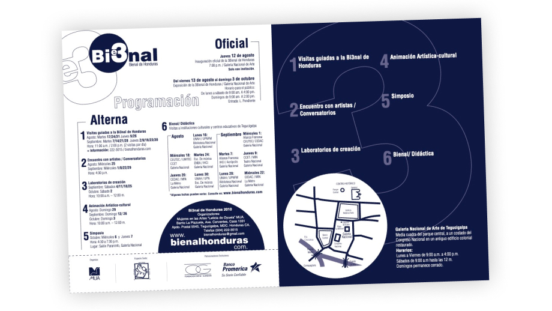

### Overview

MUA is a non profit organization in Honduras that works towards promoting culture, arts and education with an inclusive and fair perspective. We had the chance to work in the past, they gave me the opportunity to take my professional practice in order to get my degree in Graphic design.

Boletin para Tercera Bienal

Later on they reached out for UX/Technical consulting. And we agreed to work together identifying the needs and solutions regarding digital platforms and communication. 

They have developed a few new local programs to promote culture and create spaces. What we discover during the first consultation was: 

- There was a need to create and maintain online portals/sites that were easy to use for any person in the organization. The ideal scenario was to find a tool that didn’t require advanced technical skills, other than normal computer and internet expertise. 
- An option to document and present the process and achievements of the programs. Due to the amount of work, reports, resources and material we needed a feasible solution to “host” all that media. 

### The soultion & My role
After a couple of initial meetings, and collecting the requirements, we agreed on building the platforms using Wordpress.
Due to the characteristics of the client and project we worked more freely, synching and reviewing on a bi-weekly basis, and via e-mail one or two times per week for smaller items. It was challenging at the beginning, considering we were in the middle of lockdown, but everything worked out as expected. 

These are some of the outcomes: 

#### Improving Infrastructure Strategy 
Changing Hosting services so that we could have appropriate services for the organization, and customer support that could help non-technical admins with struggles related to backend and hosting. 

#### MUA (Institutional Portal) 

*MUA Website*

This is the newest project we have been working on (still in progress, but online already!). The main goal with this site is to have a single Parent Platform that can contain  all the information of the programs and initiatives that the organization develops. 

##### Keeping consistency 
The second goal was translating their Styleguide into a Design System for Wordpress. To have officially a new custom theme that goes in line with their identity and branding communication. 

##### Documenting process 
The other big part of the deliverables was an entire library of step by step tutorials for the Wordpress Site. The organization works with volunteers and usually they and the employees don’t have previous experience working with CMS and/or websites. So providing with the library of resources allows them to work efficiently and learn quickly. 

*Preparing step by step tutorials for the person in charge of updating content*

[Visit the website](https://muahn.com/)

#### Pakas
This was a pre-existing Wordpress site, before we started our engagement. During 2020’s lockdown they launched online resources such as workshops and video tutorials in collaboration with local artists. The resources were oriented to the public in general, not only to the ones interested in arts and culture. So, the organization needed their own portal to get funding. The tools and infrastructure used originally were not scalable, so that's when we started to work together. 

After planning and developing their new platform. We migrated the site and improve the entire theme. 
The site is still online: [Pakashn.com](https://pakashn.com/) but we are currently migrating and consolidating all of the MUA programs and initiatives under their new institutional site: [MUAhn.com](https://muahn.com/)

*It was a great tool and platform for artists, specially during 2020.*

### Lessons Learned

- Working on a project after they had kicked off it, it’s always challenging. In the case of the Pakas project there were some tools and libraries that were going to be too difficult to change completely (time, budget and effort) and we had to adapt to make it work with what we have at the moment. 
- Helping with cultural/art projects is really refreshing, even tho my work is done "behind the scenes". It gives a more profound retribution compared to other payed jobs. 
- Adapting my own process to the schedules and resources was hectic, and support other people with my technical expertise took some time to be shaped well. I was used to be helped by an IT person, but with MUA I am the go-to person for tech related issues. It has pushed me to be up-to-date with processes and tools. 
