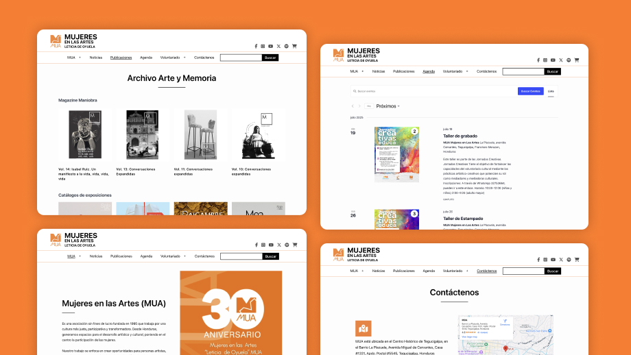
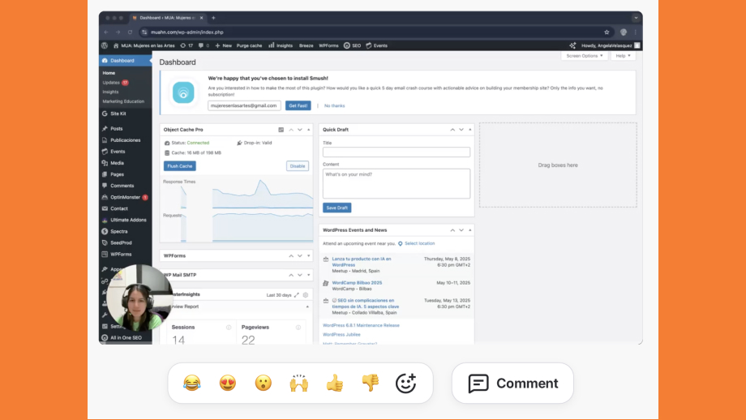
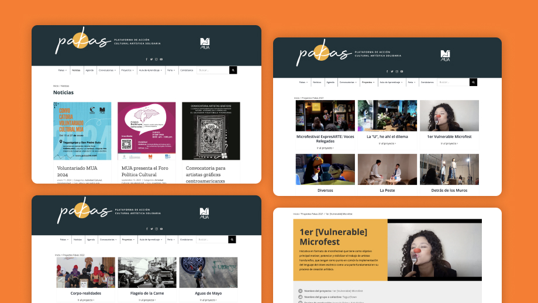

  

    <h2>MUA Mujeres en las Artes - CMS Design Case Study</h2>
    <a href="https://muahn.com/" class="button"> Live Preview </a>
  

  

    <h3> About the project</h3>
    
This project was about building a centralized platform for MUA: Mujeres en las Artes, a non profit organization based in Honduras. The goal was to create a fast, clear, and trustworthy web experience for admins and visitors.

  

## Goals

MUA needed a centralized platform to manage and present their expanding online cultural and educational programs. During the pandemic, they had launched new initiatives across social media and digital channels, but content remained fragmented.
Key objectives:

- Unify multiple content sources into a single, user-friendly portal for internal use.
- Document program processes and showcase organizational achievements.
- Deploy a scalable solution to host extensive media libraries and educational resources.

***

## The soultion

After initial discovery meetings and requirements gathering, we agreed to build a custom CMS platform using WordPress, optimized for MUA's internal team to manage diverse content types efficiently.

#### Working Approach
Given the nature of the organization and project scope, we adopted a flexible collaboration model with bi-weekly sync meetings and regular email check-ins for smaller updates. Despite the challenges of working during lockdown, this approach allowed us to maintain momentum and deliver results on schedule.

#### Strategic Planning & Implementation

##### Infrastructure Optimization
We migrated MUA to a new hosting provider that offered robust services tailored to the organization's needs, including dedicated customer support for non-technical administrators managing backend operations.

##### MUA Institutional Website
We designed and developed a centralized parent platform to house all organizational programs and initiatives under one unified digital presence. This flagship project (now live and ongoing) serves as the single source of truth for MUA's cultural and educational offerings.

##### Design System Development
To maintain brand consistency across all digital properties, we translated MUA's existing style guide into a comprehensive WordPress design system, creating a custom theme aligned with their identity and visual communication standards.

##### Knowledge Transfer & Documentation
Recognizing that MUA relies on volunteers and staff with limited CMS experience, we created an extensive library of step-by-step video tutorials. This resource empowers team members to update content independently and onboard quickly.

##### Pakas Program Migration
Pakas, an existing WordPress site launched during the 2020 lockdown, featured workshops and tutorials with local artists. The original infrastructure wasn't scalable for the organization's growth and funding needs. We rebuilt the platform, migrated all content, and enhanced the theme. The site is currently being consolidated into the new institutional platform at MUAhn.com.

*MUA Website*

*Preparing step by step tutorials for the person in charge of updating content*

*It was a great tool and platform for artists, specially during 2020.*

***

## Outcomes

#### Operational Independence
MUA transitioned from relying on external technical support to managing their platforms internally. The custom training resources and intuitive CMS structure empowered volunteers and staff to update content and publish news with lower delays.

##### Measurable impact:

- Content publishing workflow accelerated from 2-3 days to 1 hour on average
- Training library with step-by-step guides created from new staff and volunteers

##### Cost-Effective Scalability
Strategic infrastructure improvements and platform consolidation positioned MUA to scale their digital presence without proportional increases in maintenance costs or technical overhead.
Value delivered:

- Unified platform eliminated need for multiple hosting providers
- Design system is expected to reduce future development time

##### Enhanced Institutional Credibility
A professional, cohesive digital presence strengthened MUA's positioning for grant applications and community partnerships. The centralized platform demonstrates organizational maturity and impact.
Strategic outcomes:

- Consolidated 3+ fragmented initiatives into single digital hub
- Professional website infrastructure 
- Improved brand consistency across products 

#### Project Learnings
- Inheriting the Pakas project mid-development taught valuable lessons in pragmatic problem-solving. Rather than pursuing ideal solutions within tight time and budget constraints, we optimized existing infrastructure—demonstrating that strategic adaptation often delivers better value than complete rebuilds.
- Serving as the sole technical resource expanded my capacity to own complex decisions independently. Without an IT department to lean on, I developed deeper expertise across hosting, backend systems, and user support—ultimately enabling faster, more customized solutions aligned with MUA's mission-driven work.
