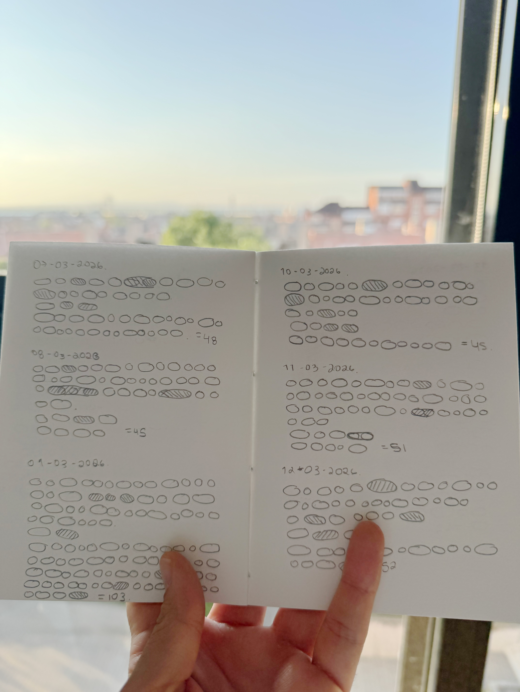

## Turning my Journal entries into a Living Grid

### The concept 

It started with the simple idea of visualizing positive and negative emotions from my journal data. Based on a sentiment analysis from custom rules.

Initially I had planned to have a frame-by-frame animation of the daily entries, to visualize the way that emotions change across time. But after exploring p5.js capabilities and understanding better my data, displaying all the entries data on a single canvas including generative behavior, will work better. That's when I decided to stablish some custom rules inspired by [Conway's Game of Life](https://p5js.org/examples/math-and-physics-game-of-life/), where the visuals carry emotions: positive, negative, and neutral; and spawn or influence other emotions across the canvas. Conceptually it connected perfectly to the idea that emotions are not static but fluid, what I was pursuing at the beginning, and how over a period of time those emotions can create "pixelated" patterns based on their behavior. 

### Ideation 

The project started analog. Before any code, I spent time familiriazing with my dataset, reading through each journal entry and translating the words into shapes representing the emotions written down. I counted positive, and negative words manually. Building my own visual language.

The original intention was to run two parallel tracks, and probably animations: my own human sentiment analysis and another one generated by AI and creating the code using p5.js, then layer them together into the final visualization. But when I started comparing the two word countings side by side, the results were surprisingly close. The differences were minor, so the adjustments needed to align them were small enough that it made more sense to polish the generated data with my manual notes rather than maintain two separate datasets.

*My manual hand-drawn journal entries*

That comparison was valuable though. It validated that the sentiment analysis captured the emotional feeling of the entries, and the adjustments I made (reclassifying a few phrases, adjusting counts) gave me confidence in the data driving the final piece.

### The Process

#### Digitalizing the Dataset 
I've started scanning the journal entries to digitalize the journal data quickly and be able to work with it. The outcome from the first Step is a JSON file where each journal entry has included the date and counts of the sentiment analysis. Each entry contains counts of positive, negative, and neutral words. 

`{
  "date": "2026-03-05",
  "counts": { "positive": 2, "negative": 8, "neutral": 2 }
}`

The JSON file was processed using a prompt on Qwen 2.5, designed to classify words into positive, negative, and neutral categories. The prompt was iterated to handle edge cases — phrases like "physically felt from a cliff" needed to be captured as negative despite containing no single obvious negative keyword.

#### Building the visualization with AI assistance
The p5.js sketch went through several iterations, each one refining the rules. The key milestones were:

- Loading the JSON data and mapping sentiment counts to colored cells. The following graphic was the firs iteration where I achieved loading properly the data and seting up the variables to work with the data. 

<iframe style="width: 520px; height: 700px; margin: 40px auto" src="https://editor.p5js.org/AngelaMeow/full/bTIX_3bNJ"></iframe>

- Defining a set of custom rules to create the desire behavior for the sentiments. The behavior is explained in the next section
- Using Claude AI to handle some refactoring and restructuring, polishing the kill logic, debugging some issue.

### The Result 

#### How the System Works

Understanding this few concepts make the data readable.
- **Originals** are the core cells, the emotion (positive, negative or neutral) words counted from the journal data. They're rendered at full opacity (yellow for positive, black for negative, lightblue for neutral). Originals are immortal: they never die, and they persist interactions.
- **Neighbors** are spawned by originals. Each frame, a positive or negative original generates new cells on empty adjacent squares, up to a maximum of 6 at any time. Neighbors are the same color as their parent but at 50% opacity. They can't spawn cells of their own. When their parent original moves, all its neighbors shift in the same direction, drifting across the grid as a cluster.
- **Dominant behavior** is determined by which emotion (positive or negative) has more counts on each entry. The dominant side gets two advantages: its originals spawn 2 neighbors per frame instead of 1, and its cells (both originals and neighbors) act as killers. The non-dominant side spawns slower and its neighbors are vulnerable.
- **Killing** happens in two ways. First, By dominance: any non-dominant neighbor that touches a cell from the dominant side, whether an original or a neighbor, is destroyed and removed from the grid. This means the dominant sentiment actively erases the opposition's spread. Second, neutral cells act as indiscriminate killers any neighbor, positive or negative, that lands adjacent to a neutral cell gets killed. Neutrals don't take sides but disrupt both.
